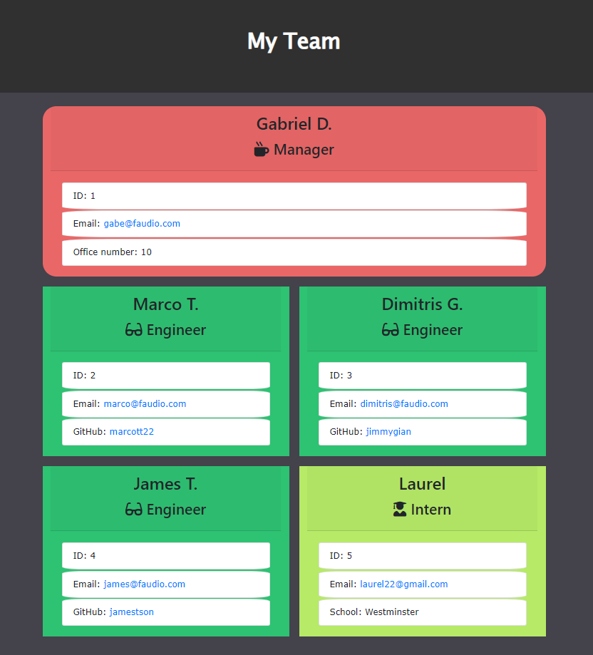

# Team Profile Generator

This repository contains a command-line application designed to generate an HTML page displaying a team's hierarchy. The application prompts users to input details for a manager, engineers, and interns. Upon completion, it creates an HTML file showcasing the team members and their roles. The project leverages Node.js, classes, inheritance, and the Inquirer.js library to facilitate user input and data rendering.

## Usage
To utilize the Team Profile Generator and generate a team hierarchy:

- Clone this repository to your local machine.
- Install the necessary npm packages by running `npm install` in your terminal.
- Run the application using the command `node index.js`.
- Follow the prompts to input details for the manager, engineers, and interns.
- Once all details are entered, the application will generate an HTML file named `team.html` in the `output` directory.

## Motivations

1. **Class & Inheritance Implementation:** The primary goal of this project was to deepen understanding and proficiency in object-oriented programming concepts, specifically classes and inheritance in JavaScript. The project structure ensures a clear hierarchy among team members, demonstrating the use of parent and child classes.

2. **Interactive CLI:** Leveraging the Inquirer.js library, the application provides an interactive command-line interface. It enhances user experience by guiding users through the process of inputting details for various team members in a structured manner.

3. **Dynamic HTML Generation:** The project emphasizes the dynamic generation of HTML content based on user input. The application creates a visually appealing and organized team profile, showcasing each member's details and role.

## Features

1. **User Input:** The application prompts users with a series of questions to gather information about the team manager, engineers, and interns. It validates user input to ensure consistency and accuracy in the generated HTML.

2. **Hierarchical Structure:** The application organizes team members into a clear hierarchy, highlighting the manager's role and displaying the engineers and interns as subordinates.

3. **HTML Rendering:** Upon collecting all necessary data, the application generates an HTML file that showcases the team members, their roles, and respective details. The generated HTML follows a structured layout, making it easy to read and understand.

## Problems Addressed

1. **Data Validation:** The application incorporates data validation to ensure that user inputs meet the required criteria. It checks for valid email formats, unique IDs, and other essential details to maintain data integrity.

2. **Error Handling:** The project includes error handling mechanisms to address potential issues during the input process or HTML generation. Proper error messages guide users in resolving issues and ensuring a smooth experience.

3. **File Management:** The application efficiently manages file creation and directory structure, ensuring that the generated HTML file is stored in the appropriate directory and easily accessible.

## Insights Gained

Through the development of the Team Profile Generator, several key insights and skills were acquired:

- **Object-Oriented Programming:** The project reinforced understanding and application of object-oriented programming principles, especially in designing class structures and leveraging inheritance.

- **Command-Line Applications:** Developing a command-line application provided valuable experience in creating interactive and user-friendly CLI tools using Node.js.

- **Data Management:** Managing user input, validating data, and structuring information for HTML generation enhanced skills in data handling and manipulation.

- **Testing with Jest:** The project introduced testing methodologies using the Jest framework, ensuring that the application functions correctly and adheres to specified requirements.

## Credits

This project was developed by Dimitris Giannoulis. The GitHub repository is available at [Team Profile Generator Repository](https://github.com/jimmygian/team-profile-gen/).

## License

This project is licensed under the MIT License, granting you the freedom to use and modify the code for your projects. Feel free to customize it to suit your requirements and contribute to its enhancement.

## Links

- GitHub Repository: [Team Profile Generator Repository](https://github.com/jimmygian/team-profile-gen/)
